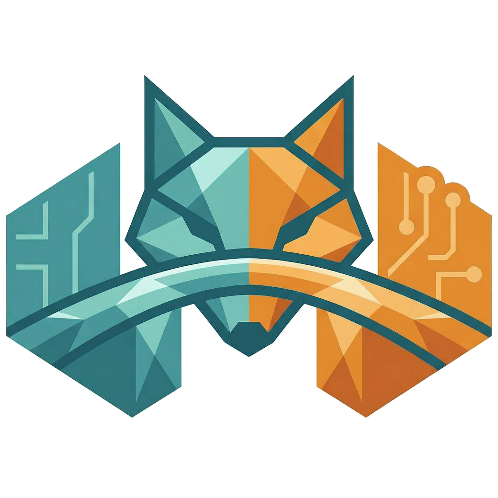

<div align="center">

<!-- TYPING SVG -->
<a href="https://git.io/typing-svg"></a>

</div>

<!-- ABOUT -->
<br/>

```js
const elliot = {
    location:    "🌏 Somewhere between NZ, Australia, Tokyo & the UK",
    setup:       "💻 Campervan + Starlink",
    role:        "Full-Stack Engineer @ Clover Labs",
    started:     "Age 13 — self-taught, no uni, straight into the deep end",
    philosophy:  "If the browser can detect it, I haven't finished yet.",
};
```

<br/>

<div align="center">

## `> what I do_`

</div>

<table align="center">
<tr>
<td width="50%" valign="top">

###  [VulpineOS](https://github.com/PopcornDev1/VulpineOS)
Operate stealth and secure OpenClaw agents at scale. A full agent operating system built on [Camoufox](https://github.com/daijro/camoufox) — manage hundreds of agents with unique fingerprints, per-agent proxies, context isolation, and zero detection. Includes a web dashboard, TUI, agent scripting DSL, token optimization (80%+ reduction), 7-layer security suite, cost tracking, webhooks, and session recording. Single binary, single Firefox process, shared via embedded [Foxbridge](https://github.com/PopcornDev1/foxbridge) CDP proxy. Born from my work at Clover Labs where I implemented per-context fingerprint spoofing on Camoufox.

</td>
<td width="50%" valign="top">

###  [Foxbridge](https://github.com/PopcornDev1/foxbridge)
The first open source CDP-to-Firefox protocol proxy — via Juggler and WebDriver BiDi. Lets Puppeteer, OpenClaw, and any CDP tool control Camoufox or standard Firefox. Runs as an embedded server inside VulpineOS or standalone. Built in Go, built because nothing else did this.

</td>
</tr>
<tr>
<td width="50%" valign="top">

### 🔄 [Flippify](https://flippify.io/)
A platform we built for resellers to stop doing everything manually. It syncs inventory and crosslists across marketplaces using APIs and browser extensions — automating everything after you've purchased stock, to just before you ship the item. The future of reselling.

</td>
<td width="50%" valign="top">

### 🔗 [neo-mcp](https://github.com/PopcornDev1/neo-mcp)
Gives AI agents direct access to every platform you're logged into - not through the UI, but through the real internal APIs websites use themselves, via your existing browser session. Zero API keys, zero setup. For platforms that aren't built in, `discover_api` reverse-engineers any site's API in seconds and saves it permanently. One request can chain actions across multiple platforms in parallel.

</td>
</tr>
</table>

<br/>

<div align="center">

## `> tech stack_`


<sub>(the other 43 icons seemed excessive)</sub>

<br/>

[](mailto:e.coileybusiness@gmail.com)


</div>
